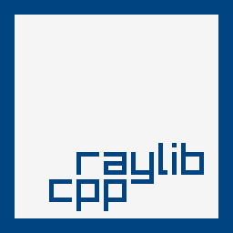

# raylib-cpp [](https://github.com/RobLoach/raylib-cpp/actions?query=workflow%3ATests+branch%3Amaster) [](LICENSE)

[raylib-cpp](https://github.com/robloach/raylib-cpp) is a C++ wrapper library for [raylib](https://www.raylib.com), a simple and easy-to-use library to enjoy videogames programming. This C++ header provides object-oriented wrappers around *raylib*'s struct interfaces. *raylib-cpp* is not required to use *raylib* in C++, but the classes do bring using the raylib API more inline with C++'s language paradigm.

## Example

``` cpp
#include "raylib-cpp.hpp"

int main() {
    int screenWidth = 800;
    int screenHeight = 450;

    raylib::Window window(screenWidth, screenHeight, "raylib-cpp - basic window");
    raylib::Texture logo("raylib_logo.png");

    SetTargetFPS(60);

    while (!window.ShouldClose())
    {
        BeginDrawing();

        window.ClearBackground(RAYWHITE);

        DrawText("Congrats! You created your first window!", 190, 200, 20, LIGHTGRAY);

        // Object methods.
        logo.Draw(
            screenWidth / 2 - logo.GetWidth() / 2,
            screenHeight / 2 - logo.GetHeight() / 2);

        EndDrawing();
    }

    // UnloadTexture() and CloseWindow() are called automatically.

    return 0;
}
```

See the [examples folder](examples) for more of the raylib examples that have been ported over to *raylib-cpp*.

## Features

There are a few conventions that raylib-cpp takes on when adopting raylib. See the [raylib-cpp documentation](https://robloach.github.io/raylib-cpp/index.html) for details on the entire API.

### Constructors

Object constructors load raylib objects.

``` cpp
// raylib
Texture2D texture = LoadTexture("texture.png");

// raylib-cpp
raylib::Texture2D texture("texture.png");
```

### Object Methods

When a raylib method has an object as one of its arguments, you can call the method on the object itself.

``` cpp
// raylib
Vector2 position(50, 50);
DrawPixelV(position, PURPLE);

// raylib-cpp
raylib::Vector2 position(50, 50);
position.DrawPixel(PURPLE);
```

### Method Names

If a method's name contains an object's name, it is removed from its name to shorten the method name.

``` cpp
// raylib
DrawTexture(texture, 50, 50, WHITE);

// raylib-cpp
texture.Draw(50, 50, WHITE);
```

### Optional Parameters

Many methods have optional parameters with sane defaults.

``` cpp
// raylib
DrawTexture(texture, 50, 50, WHITE);

// raylib-cpp
texture.Draw(50, 50); // WHITE is provided as the default tint.
```

### Object Destructors

Objects will attempt to unload their respective raylib resources on destruction. This means that there is no need to call Unload or Close methods. This applies to the window, textures, images, sounds, etc.

``` cpp
// raylib
InitWindow(640, 480, "Hello World");
CloseWindow();

// raylib-cpp
raylib::Window window(640, 480, "Hello World");
// window.Close() will be called automatically when the object is destructed.
```

### Property Get/Set

Properties can be assigned through getter and setter methods. However, you still have access to the internal properties.

``` cpp
// raylib
Vector2 position;
position.x = 50;
position.y = 100;

// raylib-cpp
raylib::Vector2 position;
position.SetX(50);
position.SetY(100);

// ... or
position.x = 50;
position.y = 100;
```

### Function Overloading

Many similar raylib method names have different name suffixes based on what arguments they take. With raylib-cpp, these cases use [function overloading](https://en.wikipedia.org/wiki/Function_overloading) to allow using the same method names.

``` cpp
// raylib
Color color = GRAY;
DrawPixel(50, 50, color);
Vector2 position = {50.0f, 50.0f};
DrawPixelV(position, color); // Extra V in method name.

// raylib-cpp
raylib::Color color = raylib::Color::Gray();
color.DrawPixel(50, 50);
Vector2 position(50.0f, 50.0f);
color.DrawPixel(position); // No V in method name.
position.DrawPixel(color); // Alternatively
```

### Method Chaining

When there's a method that doesn't return anything, in most cases it'll return the object itself, allowing [method chaining](https://en.wikipedia.org/wiki/Method_chaining).

``` cpp
// raylib
Image cat = ImageLoad("cat.png");
ImageCrop(&cat, (Rectangle){ 100, 10, 280, 380 });
ImageFlipHorizontal(&cat);
ImageResize(&cat, 150, 200);

// raylib-cpp
raylib::Image cat("cat.png");
cat.Crop(100, 10, 280, 380)
   .FlipHorizontal()
   .Resize(150, 200);
```

### Operators

There are [operator overloads](https://en.wikipedia.org/wiki/Operator_overloading) implemented for objects.

``` cpp
// raylib
Vector2 position = {50, 50};
Vector2 speed = {10, 10};
position.x += speed.x;
position.y += speed.y;

// raylib-cpp
raylib::Vector2 position(50, 50);
raylib::Vector2 speed(10, 10);
position += speed; // Addition assignment operator override.
```

### Vector-Based Returns

When there is a function that would return a pointer-array, there is a wrapper that allows returning a [vector](https://www.cplusplus.com/reference/vector/vector/) of objects instead.

``` cpp
// raylib
FilePathList files = LoadDirectoryFiles(".");
TraceLog(LOG_INFO, "Count: %i", files.count);
for (int i = 0; i < files.count; i++) {
    TraceLog(LOG_INFO, "File: %s", files.paths[i]);
}
UnloadDirectoryFiles(files);

// raylib-cpp
std::vector<std::string> files = raylib::GetDirectoryFiles(".");
TraceLog(LOG_INFO, "Count: %i", files.size());
for (auto& file : files) {
    TraceLog(LOG_INFO, "File: %s", file.c_str());
}
```

### String Functions

Many of the raylib functions have `std::string`-related overrides to allow calling them directly with `std::string`s and avoid having to use the `.c_str()` method.

``` cpp
// raylib
const char* url = "https://raylib.com";
OpenURL(url);

// raylib-cpp
std::string url = "https://raylib.com";
raylib::OpenURL(url);
```

### Exceptions

When loading an asset fails, raylib will log a warning, but provide no other feedback for you to act upon. raylib-cpp will throw a [`RaylibException`](include/RaylibException.hpp) [runtime exception](https://en.cppreference.com/w/cpp/error/runtime_error), allowing to provide a safe method for catching failed loads.

``` cpp
// raylib
Texture texture = LoadTexture("FileNotFound.png");
if (texture.width == 0) {
    TraceLog(LOG_ERROR, "Texture failed to load!");
}

// raylib-cpp
try {
    raylib::Texture texture("FileNotFound.png");
}
catch (raylib::RaylibException& error) {
    TraceLog(LOG_ERROR, "Texture failed to load!");
}
```

### RayMath

The [raymath](https://github.com/raysan5/raylib/blob/master/src/raymath.h) methods are included.

``` cpp
// raylib
Vector2 direction = {50, 50};
Vector2 newDirection = Vector2Rotate(direction, 30);

// raylib-cpp
raylib::Vector2 direction(50, 50);
raylib::Vector2 newDirection = direction.Rotate(30);
```

## Getting Started

*raylib-cpp* is a header-only library. This means in order to use it, you must link your project to [raylib](https://www.raylib.com/), and then include [`raylib-cpp.hpp`](raylib-cpp/include/raylib-cpp.hpp).

1. Set up a *raylib* project using the [build and install instructions](https://github.com/raysan5/raylib#build-and-installation)
2. Ensure `.cpp` files are compiled with C++
3. Download *raylib-cpp*
4. Include [`include/raylib-cpp.hpp`](include/raylib-cpp.hpp)
    ``` cpp
    #include "path/to/raylib-cpp.hpp"
    ```

### Starter Projects

The [projects directory](projects) includes some starter templates...

- [CMake template](projects/CMake)
- [Make template](projects/Make)
- [VSCode template](projects/VSCode)

If there's a project template you would like to see added, feel free to [make an issue](https://github.com/RobLoach/raylib-cpp/issues) and we can add it in.

### Applications

- [Ian Pan's Raylib Games](https://github.com/ianpan870102/raylib-practices)

## Development

The following are some tools in order to build and contribute to *raylib-cpp*...

### Compiling

Since *raylib-cpp* is a header only library, the build process is the same as raylib's, except you will use C++ to compile instead of C. The following are some specific instructions on local development.

#### Desktop

*raylib-cpp* uses [CMake](https://cmake.org) as a primary target for development. To build it, and run the tests or examples, use...

``` bash
git clone https://github.com/RobLoach/raylib-cpp.git
cd raylib-cpp
mkdir build
cd build
cmake ..
make
make test
./examples/core_basic_window
```

#### Web

Use [emscripten](https://emscripten.org/) to build and test [core_basic_window_web.cpp](examples/core/core_basic_window_web.cpp).

```
mkdir build
cd build
emcmake cmake .. -DPLATFORM=Web -DCMAKE_BUILD_TYPE=Release -DCMAKE_EXE_LINKER_FLAGS="-s USE_GLFW=3"
emmake make
```

See [`core_basic_window_web.html`](examples/core/resources/core_basic_window_web.html) for an example HTML canvas you can you.

### Documentation

To build the document with [Doxygen](http://www.doxygen.nl/), use...

```
git submodule update --init
doxygen projects/Doxygen/Doxyfile
```

To publish the documentation to GitHub Pages, use...

```
npm run deploy
```

### Coding Standards

This uses cpplint to adopt coding standards.

```
cpplint --recursive include
```

### Defines

- `RAYLIB_CPP_NO_MATH` - When set, will skip adding the `raymath.h` integrations

## License

*raylib-cpp* is licensed under an unmodified zlib/libpng license, which is an OSI-certified, BSD-like license that allows static linking with closed source software. Check [LICENSE](LICENSE) for further details.
